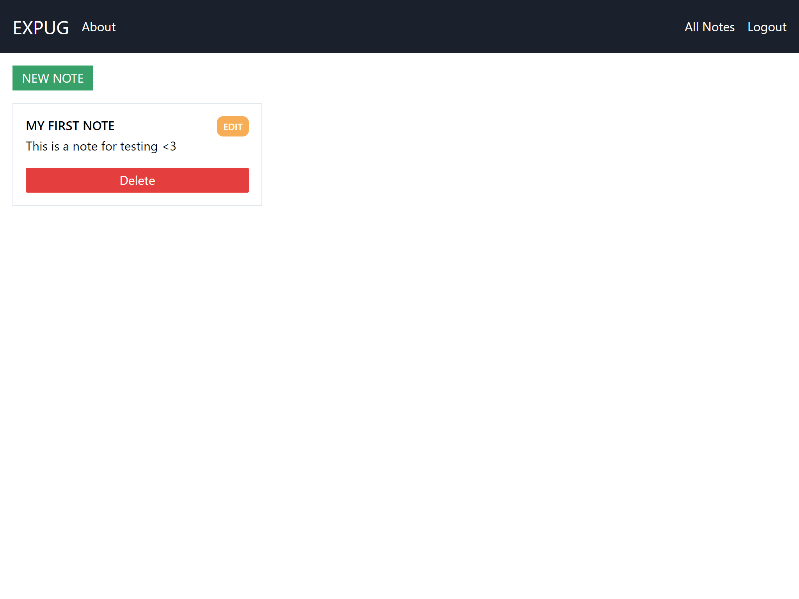

# Notes Application

_You can save your personal notes, edit and delete them._

## Built with

-  [Tailwind.css](https://tailwindcss.com/)
-  [MongoDB](https://www.mongodb.com/es)
-  [ExpressJS](https://expressjs.com/es/)
-  [Passport](http://www.passportjs.org/)
-  [PugJS](https://pugjs.org/api/getting-started.html)

## Starting

_You can clone this repository to have the project local:_

```bash
git clone https://github.com/angelozdev/notes-app.git
```

_Install the necessary dependencies in the root of the project._

```bash
npm install
```

_Run the following command to start the project in development mode:_

```bash
npm run dev
```

_Or run the following command to start the project in production mode:_

```bash
npm start
```


## Preview


## Contributing

Pull requests are welcome. For major changes, please open an issue first to discuss what you would like to change.

Please make sure to update tests as appropriate.

## License

[MIT](https://choosealicense.com/licenses/mit/)
